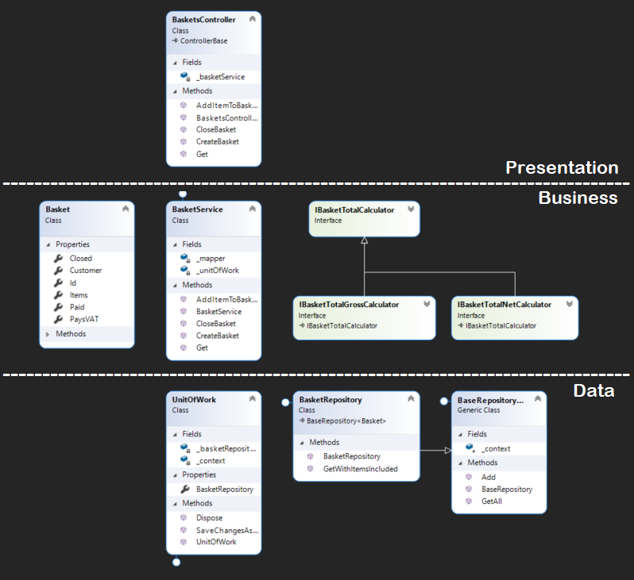

# BasketBackend
.NET Core &amp; PostgreSQL project that contains a simple API around the "Basket" entity

### Get started
1. clone the repo
2. run **docker-compose up --build**
3. navigate to localhost:8000 in order to access swagger

### Notes

* The implementation does not reflect 100% of the specifications, because some of the items were not clear to me, but I left an explanation comment wherever any assumption was made. 
* Besides all of the comments in code, I would be happy to answer any other questions that you have regarding the implementation :D

### Class diagram

Simplified version of the class diagram. Some components are missing, but the most important ones are there. Also removed a couple of interfaces, and that is why it does not reflect the architecture in detail. See the code for a more detailed view.

